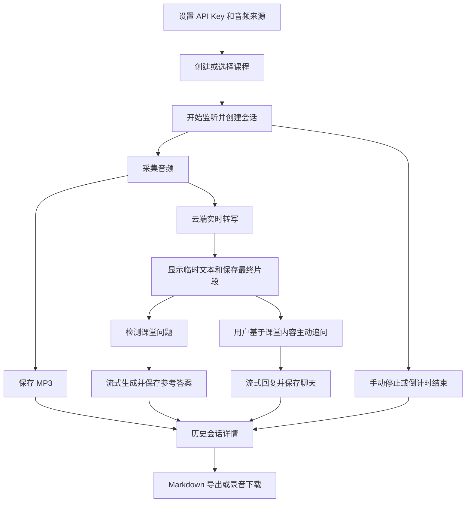

# Class Copilot 完整功能说明

> 分支说明：本文的实现现状、接口、目录和运行方式均指旧版基线；新版尚未实现。旧源码链接固定到基线提交。

> 本文描述重构前的当前实现。基线、验证限制及阅读入口见 [文档索引](README.md)。功能编号 `F-xx` 与 [重构需求与验收](重构需求与验收.md) 一一对应。

## 1. 产品定位与范围

Class Copilot 是在本机运行、通过浏览器操作的课堂助手。用户将一次课堂收听归入课程，系统采集音频、保存录音、调用云端模型转写，并根据课堂内容自动识别问题、生成参考答案。用户也可以主动追问，课后查看和导出记录。

主要使用者是需要课堂记录和问答辅助的学习者。当前没有账号体系、管理员角色、不同用户之间的数据隔离或协作权限；同一后端进程的所有浏览器连接共享一个正在监听的会话。

“本地运行”指应用、数据库和录音文件位于本机。语音识别、问题检测、回答和聊天依赖 DashScope 云服务，需要网络和 API Key；音频及相关文本会发送到相应服务。

### 1.1 业务对象

| 对象 | 含义 | 主要关系 |
| --- | --- | --- |
| 课程 | 组织课堂记录的分类，例如“线性代数” | 一门课程可有多个会话 |
| 会话 | 一次开始监听至停止或中断的过程 | 必须属于一门课程 |
| 转写片段 | 云端识别返回的课堂文本 | 最终片段保存到会话，临时文本仅实时显示 |
| 检测问题 | 自动识别或手动触发产生的课堂问题 | 与主动聊天消息分开存储 |
| 答案 | 对检测问题生成的参考答案 | 按问题和答案类型唯一保存 |
| 聊天消息 | 用户主动提问及模型回复 | 属于当前会话，包含角色和回复使用的模型 |
| 设置 | 模型、语言、音源、检测参数和凭据 | 后端全局配置；界面语言和主题另存浏览器 |

### 1.2 核心流程

### 1.3 当前不具备的能力

没有暂停后继续同一会话、历史会话续聊、离线本地模型、说话人识别、教师过滤、课堂资料上传、知识库检索、人工编辑转写、独立摘要生成、笔记编辑、答案重新生成、录音内嵌播放器、音文定位、ZIP/PDF/字幕导出、账号同步、系统托盘、全局快捷键或使用量计费统计。文件音源属于调试入口，不是完整的录音上传产品功能。

## 2. 页面与导航

| 路由 | 页面 | 用户可见内容与主要操作 |
| --- | --- | --- |
| `/` | 监听 | API Key 缺失提示、课程选择和新建、开始/停止、自动停止设置、状态、麦克风电平、实时转写 |
| `/qa` | 课堂问答 | 问题列表、来源和置信度、答案、生成进度、强制回答 |
| `/chat` | 主动提问 | 会话对话、输入框、质量/快速模式、深度思考开关 |
| `/sessions` | 历史会话 | 搜索、课程筛选、日期分组、刷新、重命名、删除、打开详情 |
| `/sessions/:id` | 会话详情 | 会话信息、转写/问答/聊天三个标签页、Markdown 导出、录音下载 |
| `/settings` | 设置 | 音频、模型和语言、课程管理、API Key、折叠的高级参数 |

全局顶部提供导航、界面语言和主题切换。连接异常时显示横幅，操作结果和错误使用 Toast。未知前端路由呈现监听页。界面包含响应式网格，但未发现移动端专用导航或完整移动端验收。

来源：[App.tsx](https://github.com/tianzheng-zhou/class_copilot/blob/b30529498043e6889f181f994c74623de1b399ba/frontend/src/App.tsx)、[AppLayout.tsx](https://github.com/tianzheng-zhou/class_copilot/blob/b30529498043e6889f181f994c74623de1b399ba/frontend/src/components/AppLayout.tsx)、[pages](https://github.com/tianzheng-zhou/class_copilot/tree/b30529498043e6889f181f994c74623de1b399ba/frontend/src/pages)。

## 3. 启动与首次配置（F-01～F-02）

### F-01 本地运行与初始化

- 后端固定监听 `127.0.0.1:29037`，浏览器访问同地址。
- 首次启动创建数据、日志和录音目录，初始化 SQLite 表以及本地加密密钥。
- 前端构建产物存在时由后端托管；通过模块入口启动还会延迟尝试打开浏览器。
- 没有前端构建产物时，首页返回 503，提示先构建前端或使用开发模式。
- 启动时将数据库遗留的 `active` 会话改为 `interrupted`。这不恢复录音，也不补齐结束时间、录音时长等字段。
- 没有自动安装依赖、桌面安装器或数据库版本迁移流程。

### F-02 API Key 配置

- 首页在未配置时显示引导；开始监听按钮要求 API Key 已设置。
- 设置页显示“已设置/未设置”和脱敏值，可进入编辑、显示/隐藏正在输入的新值、保存或取消。
- 后端用 Fernet 加密后存入 SQLite；密钥文件位于数据目录。读取配置仅返回前 4 个字符加 `****` 和布尔字段 `dashscope_api_key_set`。
- 保存不校验云端 Key 是否可用；错误可能在首次实际调用时出现。
- UI 保存按钮要求非空值，没有专门的清除按钮；API 可提交空字符串清除。
- 更新 Key 会重建用于后续 LLM 调用的客户端。已经创建的 ASR 对象保留原 Key，不能据此认为正在进行的语音连接也立即换 Key。

来源：[bootstrap.py](https://github.com/tianzheng-zhou/class_copilot/blob/b30529498043e6889f181f994c74623de1b399ba/class_copilot/bootstrap.py)、[settings.py](https://github.com/tianzheng-zhou/class_copilot/blob/b30529498043e6889f181f994c74623de1b399ba/class_copilot/application/settings.py)、[crypto.py](https://github.com/tianzheng-zhou/class_copilot/blob/b30529498043e6889f181f994c74623de1b399ba/class_copilot/infrastructure/crypto.py)。

## 4. 课程管理（F-03～F-05）

### F-03 创建与选择课程

- 监听页新建课程，输入名称后提交；支持 Enter 提交和 Escape 收起编辑。
- 名称前后空白会去除；空名称拒绝，重复名称返回冲突。没有单独的课程描述、学期、教师或课程代码。
- 创建成功后自动选中新课程。加载课程列表时，若原选择无效，默认选择列表第一项。
- 课程列表由后端按 `updated_at` 倒序排列。选择保存在前端内存，刷新后不保证恢复之前选择。
- 正在监听时，常规课程选择和新建入口被禁用；不会把进行中的会话改挂到其他课程。

### F-04 课程查看与重命名

- 设置页显示课程名称、会话数、创建日期以及操作按钮。
- 会话数由前端获取全部会话后统计，不是独立统计接口。
- 重命名在弹窗内进行，同样去除前后空白、禁止空名称和重名。
- 历史会话通过课程关系读取当前课程名，因此改名影响历史列表、详情和导出文件名中的课程名；不会重命名物理 MP3 文件。

### F-05 删除课程

- 仅允许删除没有任何会话的课程；UI 对有会话的课程禁用删除，后端再次检查并返回 409。
- 删除前有确认弹窗；删除后不提供撤销或回收站。
- 删除当前选中的空课程后，前端改选剩余第一门课程或清空选择。
- 课程管理页没有新建按钮，新建入口在监听页。

来源：[CourseSelect.tsx](https://github.com/tianzheng-zhou/class_copilot/blob/b30529498043e6889f181f994c74623de1b399ba/frontend/src/components/home/CourseSelect.tsx)、[CourseManageSection.tsx](https://github.com/tianzheng-zhou/class_copilot/blob/b30529498043e6889f181f994c74623de1b399ba/frontend/src/components/settings/CourseManageSection.tsx)、[repositories.py](https://github.com/tianzheng-zhou/class_copilot/blob/b30529498043e6889f181f994c74623de1b399ba/class_copilot/infrastructure/persistence/repositories.py)。

## 5. 音频来源与电平（F-06～F-09）

音频由后端进程所在电脑采集，浏览器负责控制和展示，不通过浏览器麦克风 API 上传音频。输入统一处理为 16 kHz、单声道、16 位 PCM，并同步编码录音。

### F-06 麦克风

- 设置页列出可用输入设备，可选择系统默认设备或指定设备；支持刷新列表。
- 设备列表返回索引、名称、通道数、默认采样率、默认设备标记。
- 枚举会过滤部分虚拟、输出和重复设备；因此不等同于系统的原始设备列表。
- 切换来源时清空设备选择；采集设备在开始监听时确定。
- 麦克风启动失败会产生设备错误。当前没有热插拔自动切换设备的流程。

### F-07 系统回环

- 用于采集本机系统播放声音；可用性取决于系统音频环境。
- 设置页列出扬声器设备，并在枚举不可用时禁用回环选项。
- **实现缺口：**界面允许选择回环设备，但采集线程始终读取系统默认扬声器，未使用保存的 `audio_device_id`。当前不能承诺录到用户指定的非默认回环设备。

### F-08 本地文件音源（仅调试）

- 仅 `CC_DEBUG_AUDIO_FILE=true` 时显示并允许配置。
- 输入的是后端可访问的本地路径，支持 `~` 展开；没有文件上传、拖拽、文件选择器或批处理。
- 使用本机 `ffmpeg` 解码并按约 0.1 秒一块实时节奏送入与麦克风相同的转写流水线。
- 文件不存在或没有 `ffmpeg` 时报告错误；支持的具体编码格式由本机 `ffmpeg` 决定。
- 文件结束后提交剩余音频，等待识别，再尝试自动停止；不是离线高速批量转写。
- 调试关闭时，PATCH 文件音源返回 403；若库中遗留文件音源，公开设置将其显示为麦克风，但开始监听仍会检查真实配置并拒绝文件模式。

### F-09 麦克风测试与电平

- 设置页可开始/停止测试，UI 在约 5 秒后自动结束测试。
- 监听页在监听期间开启电平显示，显示 dBFS、峰值和削波状态。
- 后端电平事件最多约每 0.1 秒推送一次，峰值达到 `0.99` 标记削波。
- 测试本身不启动 ASR、不创建会话、不写录音；它打开独立的麦克风流。
- 即使选择了回环音源，电平监测也使用默认麦克风，不代表回环的实际录音电平。文件模式设置页隐藏测试，但监听页仍有麦克风电平组件。
- UI 离开相关页面会释放其电平监测引用；监听本身继续。多浏览器之间没有全局订阅引用计数。

来源：[AudioSection.tsx](https://github.com/tianzheng-zhou/class_copilot/blob/b30529498043e6889f181f994c74623de1b399ba/frontend/src/components/settings/AudioSection.tsx)、[capture.py](https://github.com/tianzheng-zhou/class_copilot/blob/b30529498043e6889f181f994c74623de1b399ba/class_copilot/infrastructure/audio/capture.py)、[monitor.py](https://github.com/tianzheng-zhou/class_copilot/blob/b30529498043e6889f181f994c74623de1b399ba/class_copilot/infrastructure/audio/monitor.py)。

## 6. 监听与会话生命周期（F-10～F-13）

### F-10 开始监听

前端启用开始按钮的条件：WebSocket 已连接、当前未监听、已选择课程、已设置 API Key。

正常流程：

1. 用户选择课程和可选的自动停止时长，发送开始命令。
2. 后端检查是否已有监听、Key、课程和调试音源条件。
3. 创建新的 `active` 会话；按 UTC 起始日期记录 `date`，录音路径设为 `{session_id}.mp3`。
4. 建立云端 ASR 连接，再启动采集和录音。
5. 启动音频发送、结果处理、ASR 监督及可选的自动停止任务，广播监听状态。
6. 前端首次进入监听态时清空上一会话的实时转写、问答和聊天内存。

单进程只设计了一个活动监听槽位，但开始/停止流程没有完善的并发锁或重复请求标识。每次开始都创建新会话，不会续记已停止的会话。ASR 或设备启动失败可能留下 `interrupted` 历史记录。

### F-11 手动停止

- 点击停止后请求关闭采集、写完 MP3、发送剩余音频、等待最终识别并关闭 ASR。
- 更新会话结束时间、状态、录音时长和文件大小，广播停止状态。
- 停止按钮结束本次会话；虽然使用类似暂停的图标，但没有暂停语义。
- 前端额外轮询状态：每 500 ms 一次，最多 8 次。ASR 尾部等待可能更久，不能承诺 4 秒内完成。
- 停止后实时内容仍留在当前浏览器内存供查看；再开始新会话时清空。刷新后需从历史详情查看已保存数据。
- 没有活动会话时重复停止不做处理。停止后的后端状态查询返回 `ready`，停止瞬间的推送可为 `stopped`。

### F-12 自动停止

- UI 预设为不限时、30、60、90 分钟，也可输入自定义分钟数。
- 监听中可更改预设，或应用自定义时长；含义是从修改时重新计时，不是累计监听总时长。
- 0 秒表示关闭定时，负数在后端按 0 处理；标签字段被内部保存但不在状态中返回。
- 后端剩余时间大于 60 秒时通常每 10 秒更新，最后 60 秒每秒更新；前端直接显示服务端剩余值。
- 最后 30 秒倒计时徽标变为警告色，没有独立声音、系统通知或专门的最后 30 秒通知事件。
- 到期代码路径调用正常停止；计时任务自取消的边界仍需运行验证，见需求文档 `G-11`。

### F-13 中断处理与重启恢复

- ASR 中途断线时尝试一次重连，成功后推送通知，失败则通知、报错并尝试以 `interrupted` 结束。
- 识别到鉴权类永久错误时，发送 `asr_permanent` 并尝试中断会话；并非所有云端错误都有完整分类。
- 默认每约 12 分钟轮换 ASR 连接，继续使用同一本地会话和录音文件；轮换时尝试注入近期转写上下文。
- 后端正常退出时尝试以 `interrupted` 结束活动会话；异常退出后，下次启动只修改遗留状态。
- 浏览器关页或 WebSocket 断线不会主动停止后台录音。
- 当前没有断线音频补发、转写完整性保证、轮换无损证明或崩溃后自动续录。

### 6.1 状态的三个层次

| 层次 | 状态 | 含义 |
| --- | --- | --- |
| 数据库会话 | `active / stopped / interrupted` | 会话持久化生命周期 |
| 服务端状态推送 | `ready / listening / stopped / error` | 当前监听服务的状态通知 |
| 浏览器连接 | `connecting / open / closed` | 前端 WebSocket 连接情况 |

连接断开不等于会话停止；数据库 `interrupted` 不等于能够从中断处恢复。

来源：[session.py](https://github.com/tianzheng-zhou/class_copilot/blob/b30529498043e6889f181f994c74623de1b399ba/class_copilot/application/session.py)、[ListenControls.tsx](https://github.com/tianzheng-zhou/class_copilot/blob/b30529498043e6889f181f994c74623de1b399ba/frontend/src/components/home/ListenControls.tsx)、[handlers.py](https://github.com/tianzheng-zhou/class_copilot/blob/b30529498043e6889f181f994c74623de1b399ba/class_copilot/api/ws/handlers.py)。

## 7. 实时转写（F-14～F-16）

### F-14 展示与保存

- 实时区分临时文本与最终文本，最终文本按顺序显示，并带时间和片段数量。
- 临时文本更新时替换上一临时内容；收到最终片段后移除临时行。
- 仅最终片段写入数据库。前端按 `sequence` 更新已有行，支持同一片段的后续合并更新。
- 内容到达时自动滚动到末尾，未提供暂停跟随、全文搜索、复制专用按钮或编辑校对流程。
- 没有发言人、角色、翻译栏、识别置信度或原文/精修版本。
- 刷新或重连只恢复状态，不自动补拉已产生的实时记录；历史详情可查看已落库内容。

### F-15 分段、合并与去重

- 生产入口使用客户端提交音频分段，关闭云端 `server_vad`。
- 默认最大段长 60 秒。常规静音提交要求至少已有 12 秒音频，并满足静音、临时文本稳定及句末边界条件；达到时长限制也可提交。
- `vad_max_segment_seconds <= 0` 会关闭该客户端分段保护，不能将其理解成开启云端自动 VAD。
- 前一最终片段没有句末标点时，下一片段可能拼接并更新前一数据库记录，而不是新增片段。
- 对规范化后至少 12 字符的候选，比较最近 4 段，包含关系或相似度达到 0.82 时视为重复并丢弃。
- 上述规则有误合并和误删相似新内容的可能；当前未提供人工恢复入口。
- 设置页的 VAD 阈值和前缀补偿仍可保存，但在当前主流程下并未作为云端 VAD 参数生效。

### F-16 识别语言、模型与前文

- 可选中文、英文、中英混合。语音识别提示要求保留实际语言，不做翻译。
- 当前中英混合模式向云端转写语言字段传 `zh`，并以双语提示补充；识别效果需要实测。
- 代码提供两种 ASR 模型名，详见配置字典。
- 近期最终转写用于连续性提示，通常保留最近最多 8 段中的完整段落，限制 1,000 字符；遇到无法容纳的段落会停止向前取。
- 转写时间通常按 Unix 秒显示；服务端有上游毫秒字段则直接除以 1,000，否则使用接收时刻。上游时间若是相对偏移，当前没有统一换算，不能据此实现可靠音文定位。

来源：[qwen_omni.py](https://github.com/tianzheng-zhou/class_copilot/blob/b30529498043e6889f181f994c74623de1b399ba/class_copilot/infrastructure/asr/qwen_omni.py)、[session.py](https://github.com/tianzheng-zhou/class_copilot/blob/b30529498043e6889f181f994c74623de1b399ba/class_copilot/application/session.py)、[TranscriptStream.tsx](https://github.com/tianzheng-zhou/class_copilot/blob/b30529498043e6889f181f994c74623de1b399ba/frontend/src/components/home/TranscriptStream.tsx)。

## 8. 问题检测与参考答案（F-17～F-21）

### F-17 自动问题检测

- 最终转写保存后触发检测，默认使用最近 12 个最终片段。
- 较长临时文本也能触发：规范化后至少 20 字符，两次临时检测至少间隔 5 秒，文本必须变化，且上一临时检测任务已结束。上下文为最近 20 段最终文本加当前临时文本。
- 检测模型固定为 `qwen3.5-flash`，关闭深度思考，实际发送上下文最后 6,000 字符。
- 检测输出包含是否有问题、问题文本、置信度和关联上下文；无问题、空问题或无法解析的 JSON 不生成问题。
- 通过过滤后保存问题，来源为 `auto`，随后自动生成一档答案。当前没有只转写、关闭自动检测或检测后人工确认再回答的开关。
- 模型识别的是课堂文本中的问题，没有教师身份过滤。

### F-18 置信度、冷却与去重

- 置信度低于阈值（默认 0.7）时丢弃。
- 自动检测距离上一次成功接受的问题不足冷却时间（默认 15 秒）时跳过。
- 使用文本序列相似度与最近 20 个已接受问题比较，达到阈值（默认 0.8）即丢弃。
- 冷却从“成功接受问题”起算，不是每次模型请求起算。
- 检测器当前由应用共享，开始新会话时未重置冷却和去重记录，可能跨课程影响检测；这是实现缺口。

### F-19 手动检测（协议能力）

- WebSocket 支持 `manual_detect`，使用最近 20 个最终片段。
- 跳过自动检测的冷却限制，但仍受置信度和相似度过滤；被接受的问题来源为 `manual`。
- 接受后沿用自动回答流程。无活动流水线时无操作，没有单独“未发现问题”结果。
- **当前页面没有手动检测按钮。**问答页的手动操作是下面的强制回答，二者不等价。

### F-20 强制回答

- 问答页在监听中允许点击“强制回答”。
- 不调用问题检测，不受检测置信度、冷却和去重限制。
- 每次新建一个固定文本“请根据当前课堂内容生成参考答案”的问题，来源 `manual`、置信度 `1.0`，关联最近 20 段最终转写后生成答案。
- 即使没有有效转写也没有额外的空上下文拦截；没有填写自定义问题的弹窗。

### F-21 答案生成与浏览

- 每个问题按当时设置生成 `brief`（简要）或 `detailed`（详细）的一档答案。
- 回答模型可选择 `qwen3.5-flash / qwen3.5-plus`；回答语言支持中文、英文或双语。自动回答始终关闭深度思考。
- 先推送生成开始，再推送增量和累计全文，最后保存完整答案并推送完成事件。没有保存生成中片段的恢复机制。
- 左侧问题列表新问题在前，显示来源、置信度和生成状态；右侧显示选中问题和 Markdown 答案。
- 第一条问题会自动选中；之后新问题不自动抢占已选问题。
- 数据库允许同一问题有不同答案类型，但正常流程只生成一档，没有并行双答案、切换后补生成、指定问题重答或取消生成的入口。
- 答案是模型参考结果，没有事实核验、引用来源或用户反馈评分流程。

来源：[question.py](https://github.com/tianzheng-zhou/class_copilot/blob/b30529498043e6889f181f994c74623de1b399ba/class_copilot/application/question.py)、[openai_compatible.py](https://github.com/tianzheng-zhou/class_copilot/blob/b30529498043e6889f181f994c74623de1b399ba/class_copilot/infrastructure/llm/openai_compatible.py)、[QuestionAnswerPanel.tsx](https://github.com/tianzheng-zhou/class_copilot/blob/b30529498043e6889f181f994c74623de1b399ba/frontend/src/components/home/QuestionAnswerPanel.tsx)。

## 9. 主动追问（F-22～F-24）

### F-22 会话聊天

- 只有当前正在监听时可发送。输入去除前后空白，拒绝空消息；Enter 发送、Shift+Enter 换行。
- 用户消息立即显示并在后端先保存，模型回复以 Markdown 流式展示，完成后保存并标注所用模型。
- 主动提问不创建检测问题或问答区记录，单独进入 `chat_messages`。
- 跨页面切换保留当前内存对话；新会话清空实时聊天区。停止后只可阅读，历史详情也只读。
- 没有编辑、撤回、删除单条消息、重试、停止回复或分支对话。
- UI 没有因回复进行中而禁用再次发送；同一 WS 连接的服务端命令顺序等待处理，长回复可能延后同连接的停止命令。

### F-23 模型模式与深度思考

- 默认质量模式，映射到 `chat_model_default`，默认 `qwen3.5-plus`。
- 快速模式映射到 `chat_model_fast`，默认 `qwen3.5-flash`。
- 深度思考默认关闭，可按请求开启，值传给模型；应用仅展示正文，不展示独立的推理过程。
- 模式和思考开关是聊天面板状态，页面卸载后不持久保留；具体模型名可由 API 设置，设置页没有对应输入项。

### F-24 课堂上下文

- 聊天组织当前会话的全部转写、检测问题及答案、历史聊天作为上下文。
- 拼接的上下文从末尾按完整段落取，最多 32,000 字符；这不是 32,000 Token。
- 同时还向模型传入全部聊天历史消息，因此总请求不受上述 32,000 字符上限完整约束，聊天内容也会重复出现在上下文和消息列表中。
- 没有跨会话搜索、检索增强、资料知识库、外部搜索或自动摘要压缩。
- 流式事件不携带聊天请求 ID、消息 ID 或会话 ID，多标签页/多请求隔离不足。

来源：[chat.py](https://github.com/tianzheng-zhou/class_copilot/blob/b30529498043e6889f181f994c74623de1b399ba/class_copilot/application/chat.py)、[ChatPanel.tsx](https://github.com/tianzheng-zhou/class_copilot/blob/b30529498043e6889f181f994c74623de1b399ba/frontend/src/components/home/ChatPanel.tsx)。

## 10. 历史会话（F-25～F-28）

### F-25 列表、分组与查找

- 按开始时间倒序读取会话，页面按浏览器本地日期分组。
- 卡片展示自定义名称（没有时用课程名）、课程、开始/结束时间、状态。
- 可按课程筛选；搜索在前端对名称、课程名和 `date` 做大小写不敏感的包含匹配，约 250 ms 防抖。
- 支持手动刷新、加载态和空列表提示；没有分页、无限加载、批量选择或内容全文检索。
- 后端支持包含边界的 `date_from/date_to` 筛选；页面没有独立日期区间控件。
- 服务器按 UTC 存储的 `date` 与浏览器本地分组可能在跨日时不同。

### F-26 查看详情

- 展示标题、课程、日期、状态、起止时间、录音时长和文件大小。
- 转写标签页按顺序显示；问答标签页按问题创建时间显示；聊天按消息创建时间显示。
- 问答详情仅选择与**当前全局** `auto_answer_type` 一致的答案。若当时只生成简要答案而现在选详细，会显示该类型无答案，不自动回退。
- 关联上下文通过 API 返回，但页面不单独展示 `context_text`。
- 详情是读取时的快照，不订阅正在进行会话的实时增量。
- 没有内嵌播放器、转写跳转音频、编辑内容或继续聊天操作。

### F-27 重命名会话

- 列表卡片菜单打开重命名弹窗，保存 `custom_name`。
- UI 去除前后空白；空值保存为 `null`，恢复按课程名显示。
- 自定义名称不要求唯一，不改变课程归属、会话 ID、日期或物理录音文件名。

### F-28 删除会话

- 列表菜单操作，确认弹窗说明删除不可恢复。
- 删除数据库会话及其转写、问题、答案、聊天，再尝试删除录音文件。
- 没有回收站、撤销、备份或批量删除。
- 当前 UI 和后端都未禁止删除正在监听的会话，可能破坏随后保存流程；数据库删除和文件删除也不是同一个事务。重构验收需明确处理。

来源：[SessionsPage.tsx](https://github.com/tianzheng-zhou/class_copilot/blob/b30529498043e6889f181f994c74623de1b399ba/frontend/src/pages/SessionsPage.tsx)、[SessionDetailPage.tsx](https://github.com/tianzheng-zhou/class_copilot/blob/b30529498043e6889f181f994c74623de1b399ba/frontend/src/pages/SessionDetailPage.tsx)、[SessionListGrouped.tsx](https://github.com/tianzheng-zhou/class_copilot/blob/b30529498043e6889f181f994c74623de1b399ba/frontend/src/components/sessions/SessionListGrouped.tsx)。

## 11. 录音和导出（F-29～F-30）

### F-29 MP3 录音存档与下载

- 每个会话始终尝试录音，没有“仅转写不存录音”的开关。
- 默认路径 `data/recordings/{session_id}.mp3`，编码输入 16 kHz、单声道，码率配置 128 kbps。
- 音频先送本地编码，再排队送 ASR；ASR 队列满时可能丢掉识别帧，即使 MP3 已写入对应音频。
- 录音时长记录为采集开始至停止调用前的墙钟时间，不是重新解析 MP3 得到的精确媒体时长。
- 详情中录音路径及文件大小均为真值时显示下载按钮；异常记录即使有磁盘文件也可能因元数据缺失而隐藏。
- 下载名称为 `{date}_{清理后的课程名}.mp3`，不会采用自定义会话名。
- 没有自动磁盘清理、保留期限、容量告警、录音加密或损坏修复流程。

### F-30 Markdown 导出

- 从详情页下载，文件名 `{date}_{清理后的课程名}.md`，标题使用自定义名称或课程名。
- 包含起止 UTC 时间、完整转写文本、检测问题及答案、主动提问记录。
- 转写导出不带逐段时间；问题标题包含 `auto/manual` 来源。
- 每个问题仅导出与导出时全局 `auto_answer_type` 匹配的答案，不回退、不导出全部版本。
- 聊天按 user/assistant 配对写为 Q/A；没有回复的 user 消息被省略，连续 user 消息只保留配对前最后一条。
- 不包含音频文件、音频链接、模型使用量、问题置信度或完整问题上下文。
- 同一课程同一天多个会话的下载建议文件名可能相同，由浏览器自行处理重名。

来源：[routes.py](https://github.com/tianzheng-zhou/class_copilot/blob/b30529498043e6889f181f994c74623de1b399ba/class_copilot/api/http/routes.py)、[encoder.py](https://github.com/tianzheng-zhou/class_copilot/blob/b30529498043e6889f181f994c74623de1b399ba/class_copilot/infrastructure/audio/encoder.py)。

## 12. 设置与偏好（F-31～F-34）

### F-31 运行时设置

- 设置顺序：音频、模型与语言、课程、API Key、默认折叠的高级设置。
- 除 Key 需主动保存外，普通选择项自动提交；高级参数先更新 UI、约 500 ms 防抖保存。
- 高级 ASR 参数包括 VAD 阈值、前缀补偿、静音时长、轮换分钟数、最长片段秒数；问题参数包括置信度、相似度、冷却时间。
- 数值控件存在前端边界，但后端没有完整范围校验；不能把界面约束当成 API 保证。
- 同一高级分区多个字段共用防抖回调，快速连续调整不同字段可能只提交最后一个字段。离开页面也会取消尚未提交的定时器。
- 当前没有整体保存、重置默认、配置导入导出、修改历史或连接测试。

### F-32 配置持久化与生效

- 后端设置存入 SQLite，重启加载；只有 Key 加密，其他值按字符串保存。
- 音频来源/设备和 ASR 实例中的模型、Key、轮换参数主要在创建新会话时确定。
- 问题过滤、后续答案和聊天配置读取当前设置；客户端分段也读取当前最长片段、静音设置。
- ASR 重连语言和轮换语言取值路径不同，不能用“全部立即生效”或“全部下次生效”概括。完整字段表见接口文档。
- 一次 PATCH 的多个设置逐项提交，未做整体事务；异常可能留下部分已保存的配置。
- 兼容旧 `language` 字段：更新它会为未在同请求指定的识别、答案、聊天语言同步赋值。界面语言不受此字段控制。

### F-33 界面语言

- 顶部切换中文/英文，保存于浏览器 `localStorage["cc.lang"]`。
- 无偏好时按浏览器语言初始化：中文浏览器选中文，其他选英文。
- 与 ASR、自动回答和聊天的语言设置独立。
- 部分后端错误、前端提示和日期星期仍为固定中文，因此不是完全本地化。

### F-34 主题

- 支持浅色、深色；初始未设偏好时跟随系统。
- 顶部按钮切换明暗，保存于 `localStorage["cc.theme"]`；系统模式下响应系统主题变化。
- 存储层支持 `system`，但当前按钮切换后没有显式“恢复跟随系统”的入口。

来源：[settings.py](https://github.com/tianzheng-zhou/class_copilot/blob/b30529498043e6889f181f994c74623de1b399ba/class_copilot/application/settings.py)、[settings components](https://github.com/tianzheng-zhou/class_copilot/tree/b30529498043e6889f181f994c74623de1b399ba/frontend/src/components/settings)、[i18n](https://github.com/tianzheng-zhou/class_copilot/blob/b30529498043e6889f181f994c74623de1b399ba/frontend/src/i18n/index.ts)、[theme.ts](https://github.com/tianzheng-zhou/class_copilot/blob/b30529498043e6889f181f994c74623de1b399ba/frontend/src/stores/theme.ts)。

## 13. 连接、提示与运行记录（F-35～F-37）

### F-35 实时连接与共享状态

- 页面加载连接 `/ws`，首条消息为后端当前状态；全局桥接转写、问答、聊天等事件，路由切换不需要重新开始监听。
- 前端断线后按 1、2、5、10、30 秒递增重连，之后维持 30 秒间隔。
- 断线期间发送的命令进入内存队列，重连后顺序补发；没有失效时间、去重标识或用户复核。
- 不存在事件补发游标、服务端历史回放、自动数据补拉或请求确认协议。
- 服务端向所有连接广播，多个标签页共享控制权；用户聊天消息只在发送端先显示，回复却广播给全部连接，不能作为完整多端同步能力。

### F-36 错误和操作反馈

- 成功、信息、警告、错误可通过 Toast 展示并手动关闭；计时器通常约 6 秒后移除，新增提示可能重置已有提示的计时。
- HTTP 业务错误通常为 `{"detail":"..."}`；字段校验错误采用框架的 422 结构。
- WS 错误包含 `code/message`，常见为配置缺失、设备不可用、ASR 永久错误、ASR 不可用、请求错误和内部错误。
- `asr_permanent/config_missing` 会存入前端 `fatalError`，但未发现使用该状态的专门错误弹窗或恢复界面。
- 没有统一请求进度、重试按钮、错误历史、失败答案状态或诊断包下载。

### F-37 本地日志与网络兼容

- 日志写入数据目录，应用/错误/模块日志按日期轮换；没有设置页日志查看器或明确的自动保留上限。
- 默认对 DashScope 指定域名使用 IPv4 DNS 解析，可通过环境配置关闭。
- 当前数据库只做建表初始化，没有迁移版本管理；备份恢复需另行设计。

来源：[client.ts](https://github.com/tianzheng-zhou/class_copilot/blob/b30529498043e6889f181f994c74623de1b399ba/frontend/src/ws/client.ts)、[connection.py](https://github.com/tianzheng-zhou/class_copilot/blob/b30529498043e6889f181f994c74623de1b399ba/class_copilot/api/ws/connection.py)、[logging.py](https://github.com/tianzheng-zhou/class_copilot/blob/b30529498043e6889f181f994c74623de1b399ba/class_copilot/logging.py)、[network.py](https://github.com/tianzheng-zhou/class_copilot/blob/b30529498043e6889f181f994c74623de1b399ba/class_copilot/infrastructure/network.py)。

## 14. 重构使用提醒

以上共 37 项功能作为现状清单，不预先决定新版本必须保留哪些页面、模型或技术实现。下一步在 [重构需求与验收](重构需求与验收.md) 中逐项修改目标行为；接口和数据迁移时参考 [接口与数据字典](接口与数据字典.md)。
