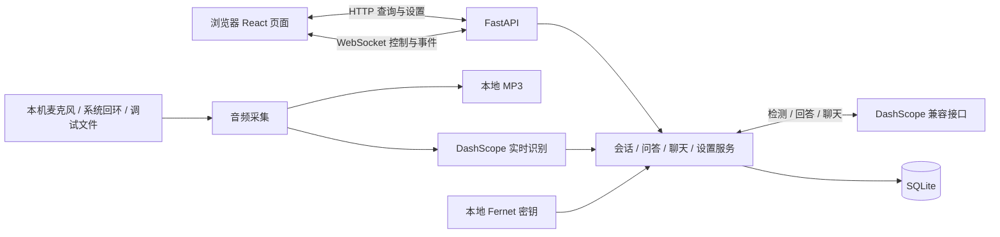
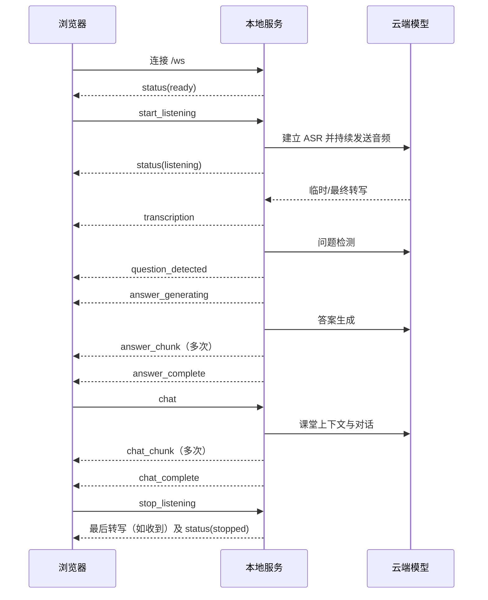
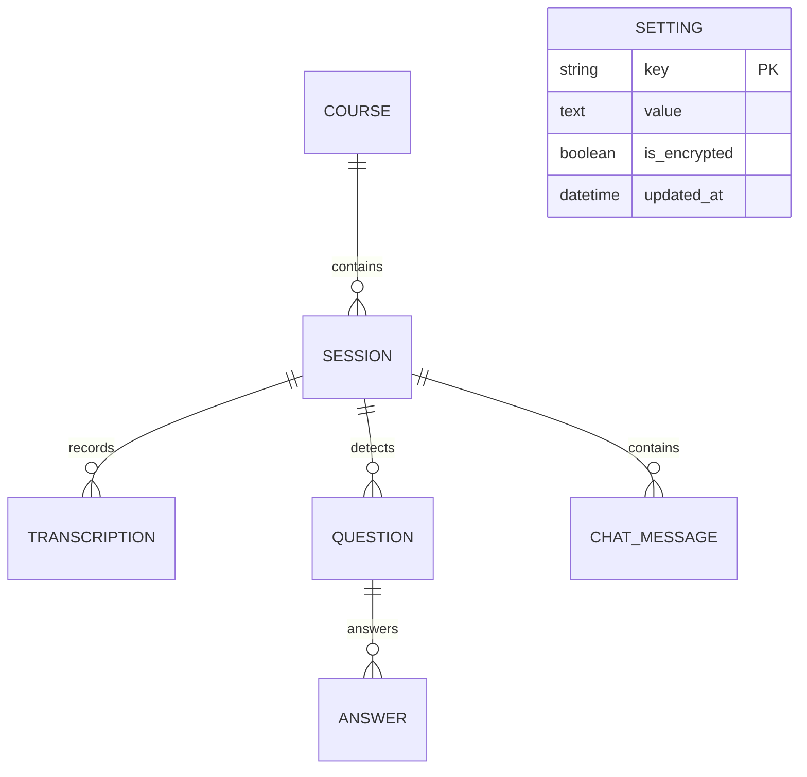

# Class Copilot 接口与数据字典

> 分支说明：本文的实现现状、接口、目录和运行方式均指旧版基线；新版尚未实现。旧源码链接固定到基线提交。

> 当前实现的技术参考，基线见 [文档索引](README.md)。业务解释见 [功能说明](功能说明.md)。本文件记录现有契约，不要求重构沿用现有架构或接口缺陷。

## 1. 系统边界与数据流



浏览器与后端之间没有音频上传流。采集、编码、模型调用和持久化由后端处理。生产入口固定为本机单进程服务，无用户认证、权限、租户或会话所有者字段。

### 1.1 代码职责

| 路径 | 职责 |
| --- | --- |
| `class_copilot/bootstrap.py` | 初始化数据库、配置、模型、连接管理和应用服务；启动恢复与退出清理 |
| `class_copilot/api/http/routes.py` | 业务 HTTP 接口、序列化、文件下载及 Markdown 导出 |
| `class_copilot/api/ws/handlers.py` | WS 命令分发和错误映射 |
| `class_copilot/application/session.py` | 监听、音频流水线、转写处理、问题触发、倒计时、ASR 监督 |
| `class_copilot/application/question.py` | 过滤检测结果、流式生成答案并保存 |
| `class_copilot/application/chat.py` | 聊天历史、上下文拼接、模型回复和保存 |
| `class_copilot/application/settings.py` | 设置加载、旧字段兼容、加密存储和运行时快照 |
| `class_copilot/domain/ports.py` | ASR / LLM 端口及结果对象 |
| `class_copilot/infrastructure/` | 音频设备、模型协议、编码、数据库、加密和网络实现 |
| `frontend/src/pages`、`components` | 页面及用户操作 |
| `frontend/src/stores`、`ws`、`api` | 前端内存状态、通信和客户端数据类型 |

## 2. 通信通则

- 业务 HTTP 前缀：`/api`；WS 路径：`/ws`；开发前端通过 Vite 转发至后端。
- HTTP 请求体和 WS 信封使用 JSON，字段为 `snake_case`。
- ID 在持久化模型中由 UUID 字符串生成；接口没有为每个 ID 做 UUID 格式校验。
- HTTP 时间字段一般序列化为 UTC ISO 8601，形如 `2026-09-18T05:00:00Z`。
- 会话 `date` 为创建时 UTC 日期字符串 `YYYY-MM-DD`；查询按字符串比较，没有严格日期解析。
- 转写 `start_time/end_time` 是浮点秒；当前适配器直接转换上游毫秒字段或回退到接收时刻，时间基准存在不一致风险。
- 默认无分页、请求 ID、接口版本前缀或速率限制。
- FastAPI 默认提供 `/docs`、`/redoc` 和 `/openapi.json`；它们不计入下述 16 个业务接口。

## 3. HTTP 接口清单

### 3.1 课程

| 方法与路径 | 输入 | 成功响应 | 主要异常 |
| --- | --- | --- | --- |
| `GET /api/courses` | 无 | `200 Course[]`，更新时间倒序 | 通用错误 |
| `POST /api/courses` | `{"name":"线性代数"}` | `201 Course` | 去空白后为空：400；重复：409 |
| `PATCH /api/courses/{course_id}` | `{"name":"高等代数"}` | `200 Course` | 空名称：400；不存在：404；重复：409 |
| `DELETE /api/courses/{course_id}` | 无 | `204`，无响应体 | 不存在：404；有会话：409 |

`Course` 响应包含 `id, name, created_at, updated_at`。创建/改名只要求字段为字符串并检查去空白后的非空和数据库唯一性；没有 API 层长度上限。数据库声明的 `String(255)` 不等于 SQLite 自动强制 255 字符限制。

### 3.2 会话

| 方法与路径 | 输入 | 成功响应 | 主要异常/限制 |
| --- | --- | --- | --- |
| `GET /api/sessions` | 可选查询 `date_from,date_to,course_id` | `200 SessionListItem[]` | 日期边界含等号，按开始时间倒序；无分页 |
| `GET /api/sessions/{session_id}` | 路径 ID | `200 SessionDetail` | 不存在：404 |
| `PATCH /api/sessions/{session_id}` | `{"custom_name":"第一讲"}` 或 `null` | `200 SessionListItem` | 不存在：404；省略字段也会按默认 `null` 清除名称 |
| `DELETE /api/sessions/{session_id}` | 路径 ID | `204` | 不存在：404；不检查活动态；DB 删除后删除文件 |
| `GET /api/sessions/{session_id}/export.md` | 路径 ID | `200` Markdown 文本附件 | 不存在：404；只选当前答案类型 |
| `GET /api/sessions/{session_id}/recording` | 路径 ID | `200 audio/mpeg` 文件附件 | 会话/非空路径对应文件不存在：404；空路径处理有缺口 |

`SessionListItem`：

```json
{
  "id": "session-uuid",
  "course_id": "course-uuid",
  "course_name": "线性代数",
  "custom_name": null,
  "date": "2026-09-18",
  "started_at": "2026-09-18T05:00:00Z",
  "ended_at": null,
  "status": "active"
}
```

示例 ID 为占位符。详情结构为：

```text
SessionDetail
├── session: SessionListItem + recording_path? + recording_duration_seconds? + recording_file_size_bytes?
├── transcriptions: TranscriptionItem[]        # sequence 升序
├── questions: QuestionItem[]                 # created_at 升序
│   └── answers: AnswerItem[]                 # created_at 升序
└── chat_messages: ChatMessageItem[]          # created_at 升序
```

| 响应对象 | 字段 |
| --- | --- |
| `TranscriptionItem` | `id, sequence, start_time, end_time, text, is_final, created_at` |
| `QuestionItem` | `id, question_text, source, confidence, context_text, created_at, answers` |
| `AnswerItem` | `id, answer_type, content, created_at, updated_at` |
| `ChatMessageItem` | `id, role, content, model_used, created_at` |

备注：

- `course_name` 是关联表当前名称，理论类型允许空；正常外键关系下存在课程。
- 详情返回全部已存答案，前端显示时另按当前设置选一档。
- `recording_path` 是后端磁盘路径，不是可供浏览器直接播放的 URL。
- 导出文件名按日期与清理后的课程名拼接，清理空白及 `<>:"/\\|?*` 等字符。Markdown 响应带 UTF-8 附件文件名。
- 导出正文规则见 [功能说明](功能说明.md) F-30。
- 录音下载当前使用 `Path(recording_path or "")`，只检查 `exists()`；空值会落到当前目录，不能保证返回清晰的“无录音”404。
- 会话重命名 API 不像课程名称一样去空白，UI 才执行 trim；数据库同样未强制业务长度。

### 3.3 设置与状态

| 方法与路径 | 输入 | 成功响应 | 主要异常 |
| --- | --- | --- | --- |
| `GET /api/settings` | 无 | 全部公开运行时设置，另有 `dashscope_api_key_set, debug_audio_file` | 通用错误 |
| `PATCH /api/settings` | 设置字段的局部 JSON | 更新后的完整公开设置 | 文件音源未启用：403；枚举/类型校验：422；业务配置错误：400；部分空值可导致500 |
| `GET /api/status` | 无 | 与 WS `status.data` 相同 | 通用错误 |

PATCH 细节：

- 使用 `exclude_unset=True` 区分未提交字段；显式 `null` 与未提交不等价。
- Key 输入为明文，响应为脱敏值；不要把 GET 返回的脱敏 Key 原样 PATCH 回去。
- `audio_device_id:null` 是正常的“系统默认设备”用法。其他字段虽多被 schema 声明为可空，但数值字段 `null` 可能写空字符串后加载失败，不是可靠的重置语义。
- 未知请求字段在当前 Pydantic 请求模型中被忽略，不能认为接口必然返回“unknown setting”。
- 服务内部逐项提交设置，加载成功后整体替换 RuntimeSettings 对象；无全量原子提交保证。
- `debug_audio_file` 为启动配置只读派生值，不在 PATCH 模型中。

### 3.4 音频

| 方法与路径 | 输入 | 成功响应 | 主要异常 |
| --- | --- | --- | --- |
| `GET /api/audio/devices` | 无 | 设备结构，见下 | 枚举异常被转换为空列表/回环不可用 |
| `POST /api/audio/mic-monitor/start` | 无请求体 | `{"status":"started"}` 或 `already_monitoring` | 设备不可用：400 |
| `POST /api/audio/mic-monitor/stop` | 无请求体 | `{"status":"stopped"}` | 通用错误 |

设备响应：

```text
{
  microphone: {
    devices: [{index:number, name:string, channels:number, sample_rate:number, is_default:boolean}],
    current_index: number|null
  },
  loopback: {
    available: boolean,
    devices: [{id:string, name:string, is_default:boolean}],
    current_id: string|null
  },
  audio_source: "microphone"|"loopback"|"file"
}
```

上面为类型示意，不是可直接发送的 JSON。`audio_device_id` 后端允许整数或字符串，`current_index` 原样读取设置，故异常/非 UI 配置可能与前端声明不同。

### 3.5 HTTP 错误约定

| 状态码 | 当前语义 |
| --- | --- |
| 400 | 明确业务校验、配置错误、音频设备错误 |
| 403 | 非调试模式选择本地文件音源 |
| 404 | 课程、会话或录音文件不存在（见空路径例外） |
| 409 | 课程重名，或删除有会话的课程 |
| 422 | FastAPI/Pydantic 请求类型、必填字段或枚举校验失败 |
| 500 | 通用内部错误，响应通常为 `{"detail":"服务端内部错误"}` |
| 503 | 前端构建缺失时首页响应，不是业务 API 的模型健康检查 |

常规业务错误 `detail` 是字符串，422 的 `detail` 是结构化数组。前端 API 客户端只提取字符串 `detail`，因此校验错误常退化为“请求失败 (422)”。

来源：[schemas.py](https://github.com/tianzheng-zhou/class_copilot/blob/b30529498043e6889f181f994c74623de1b399ba/class_copilot/api/schemas.py)、[routes.py](https://github.com/tianzheng-zhou/class_copilot/blob/b30529498043e6889f181f994c74623de1b399ba/class_copilot/api/http/routes.py)、[error_handlers.py](https://github.com/tianzheng-zhou/class_copilot/blob/b30529498043e6889f181f994c74623de1b399ba/class_copilot/api/http/error_handlers.py)、[types.ts](https://github.com/tianzheng-zhou/class_copilot/blob/b30529498043e6889f181f994c74623de1b399ba/frontend/src/api/types.ts)。

## 4. WebSocket 契约

### 4.1 信封与连接行为

```json
{"type":"start_listening","data":{"course_id":"course-uuid","auto_stop_seconds":1800}}
```

连接被接受后直接发送一条当前 `status`。除消息外层校验错误回复发送者外，大多数业务事件和错误都广播到所有已连接浏览器。断开连接只移除连接，不停止录音。

当前协议不提供 `request_id`、确认 ACK、事件 ID、时间游标、取消请求或重放握手。命令 `data` 是宽松字典，各命令内手工转换字段，不能视为完整强类型验证。

### 4.2 客户端 → 服务端（6 类）

| `type` | `data` | 结果和约束 |
| --- | --- | --- |
| `start_listening` | `course_id:string`；可选 `auto_stop_seconds:int=0, auto_stop_label:string=""` | 创建新会话并启动监听；成功广播状态，重复监听拒绝 |
| `stop_listening` | `{}` | 完成停止；无当前会话时无操作 |
| `manual_detect` | `{}` | 当前流水线最近20段检测；不保证产生问题；无流水线时无操作 |
| `force_answer` | `{}` | 创建固定手动问题并回答；无流水线时无操作 |
| `chat` | `question:string`；可选 `model:"fast"或其他值, enable_thinking:boolean=false` | 必须有当前会话 ID 且非空问题；`fast` 用快速模型，其余用默认模型 |
| `update_auto_stop` | `seconds:int=0`；可选 `label:string=""` | 从现在重置倒计时，广播状态；当前接口未验证一定在监听 |

前端 `chat.model` 声明为 `fast/quality/null`，后端只判断是否等于 `fast`。后端思考字段通过 `bool(...)` 转换，字符串 `"false"` 等非布尔输入不具备正确语义。非法数字转换等错误会落到通用 `internal`，不存在独立命令级422。

### 4.3 服务端 → 客户端（12 类）

| `type` | `data` 字段 | 语义 |
| --- | --- | --- |
| `status` | `status, session_id, course_id, course_name, is_listening, auto_stop_remaining` | 当前监听状态，ID/名称可为 null |
| `transcription` | `session_id, text, is_final, start_time, end_time, sequence` | 临时片段 sequence=0；最终片段从1递增，同序号可更新 |
| `question_detected` | `question_id, question_text, source, confidence, context_text` | 新问题已保存；不含 session_id 或创建时间 |
| `answer_generating` | `question_id, answer_type` | 该问题开始生成某一类型答案 |
| `answer_chunk` | `question_id, answer_type, chunk, full_text` | 当前增量及从生成开始累积的全文 |
| `answer_complete` | `question_id, answer_type, content` | 完整答案已保存 |
| `chat_chunk` | `chunk, full_text` | 回复增量及累计全文，无消息/请求/会话标识 |
| `chat_complete` | `content, model_used` | 回复已保存，无消息/请求/会话标识 |
| `mic_level` | `db:number, peak:number, clipping:boolean` | 麦克风 dBFS、绝对峰值、削波标记 |
| `auto_stop_tick` | `remaining:int` | 剩余秒数，无会话 ID |
| `notification` | `level:"info"或"warning"或"error", message:string` | 非阻塞通知 |
| `error` | `code:string, message:string` | 业务/通信错误，无关联请求标识 |

状态示例：

```json
{
  "type":"status",
  "data":{
    "status":"listening",
    "session_id":"session-uuid",
    "course_id":"course-uuid",
    "course_name":"线性代数",
    "is_listening":true,
    "auto_stop_remaining":1800
  }
}
```

完成事件在持久化后发出。生成失败时没有对称的 `answer_failed/chat_failed` 事件；已经显示的部分内容可能未持久保存。

### 4.4 主要错误代码

| code | 触发情况 |
| --- | --- |
| `bad_request` | 外层 WSMessage 校验失败或未知命令；未知命令错误会广播 |
| `config_missing` | ConfigurationError，包括未配置Key、已有监听、缺少当前会话、空聊天内容等，不只表示缺字段 |
| `audio_device` | 由命令路径捕获的 AudioDeviceError |
| `asr_permanent` | 监督任务发现永久错误；当前消息固定提示检查 Key |
| `asr_unavailable` | ASR 断线后一次重连失败 |
| `internal` | 分发阶段未分类异常，包括部分参数错误、课程不存在或初次 ASR 连接失败 |

无效 JSON 的接收、后台任务异常及音频线程异常并非都经过上述映射。不要把表中的分类当作所有错误已被完整处理。

### 4.5 正常消息顺序



转写、问题、计时和电平可交错，不能依赖所有事件严格按图中串行发生。前端收到累计全文时应替换对应生成内容，不能再追加 `full_text`。

来源：[handlers.py](https://github.com/tianzheng-zhou/class_copilot/blob/b30529498043e6889f181f994c74623de1b399ba/class_copilot/api/ws/handlers.py)、[connection.py](https://github.com/tianzheng-zhou/class_copilot/blob/b30529498043e6889f181f994c74623de1b399ba/class_copilot/api/ws/connection.py)、[messages.ts](https://github.com/tianzheng-zhou/class_copilot/blob/b30529498043e6889f181f994c74623de1b399ba/frontend/src/ws/messages.ts)。

## 5. 设置完整字典

### 5.1 后端持久化运行时设置（21 项）

| 字段 | 默认值 | 类型/允许值 | UI 与生效说明 |
| --- | --- | --- | --- |
| `dashscope_api_key` | `""` | 字符串，加密 | 设置页显式保存；后续 LLM 使用新 Key，既有 ASR 不立即更换 |
| `language` | `zh` | `zh/en` | 旧兼容字段，API 可改；为未显式指定的三种输出语言赋值，不控制界面语言 |
| `asr_language` | `zh` | `zh/en/bilingual` | 设置页；新会话使用，重连/轮换细节见下 |
| `auto_answer_language` | `zh` | `zh/en/bilingual` | 下一次答案生成读取 |
| `auto_answer_model` | `qwen3.5-flash` | `qwen3.5-flash/qwen3.5-plus` | 下一次答案生成读取 |
| `chat_language` | `zh` | `zh/en/bilingual` | 下一次主动聊天读取 |
| `auto_answer_type` | `brief` | `brief/detailed` | 下一次答案生成读取；也影响历史显示与导出选择 |
| `asr_model` | `qwen3.5-omni-flash-realtime` | 同默认值或 `qwen3.5-omni-plus-realtime` | 新建 ASR 时设置，已有实例保留旧快照 |
| `chat_model_default` | `qwen3.5-plus` | 字符串，无枚举限制 | 无设置页输入；API可改，下一次 quality 聊天读取 |
| `chat_model_fast` | `qwen3.5-flash` | 字符串，无枚举限制 | 无设置页输入；API可改，下一次 fast 聊天读取 |
| `vad_threshold` | `0.3` | 浮点数 | UI 0～1，步长0.05；生产主流程关闭 server_vad，当前实际不使用该阈值 |
| `vad_prefix_padding_ms` | `500` | 整数，毫秒 | UI 非负；当前主流程不向云端启用此前缀参数 |
| `vad_silence_duration_ms` | `800` | 整数，毫秒 | UI 非负；客户端分段实时读取，最小静音按0.2秒计算 |
| `asr_session_rotate_minutes` | `12.0` | 浮点数，分钟 | UI 最小1、步长0.5；ASR 实例快照，通常新会话生效 |
| `vad_max_segment_seconds` | `60.0` | 浮点数，秒 | UI 非负；客户端分段实时读取，<=0关闭分段保护 |
| `question_confidence_threshold` | `0.7` | 浮点数 | UI 0～1，步长0.05；下一次检测过滤读取 |
| `question_cooldown_seconds` | `15` | 整数，秒 | UI 非负；自动检测冷却实时读取 |
| `question_similarity_threshold` | `0.8` | 浮点数 | UI 0～1，步长0.05；下一次检测过滤读取 |
| `audio_source` | `microphone` | `microphone/loopback/file` | 采集实例在开始时确定；file仅调试允许 |
| `audio_device_id` | `null` | 整数、字符串或null | null为默认；麦克风通常整数；回环UI字符串，采集未使用所选值 |
| `audio_file_path` | `""` | 字符串路径 | 调试文件音源，新会话采集读取 |

除上述 **21 个持久化字段**外，另有下面两个只读响应字段，不存入 Setting 表：

| 字段 | 含义 |
| --- | --- |
| `dashscope_api_key_set` | 解密加载后的 Key 是否非空 |
| `debug_audio_file` | 当前启动配置是否开放文件音源 |

UI 的语言、主题、倒计时预设、聊天质量模式、深度思考开关不属于这 21 个后端设置。

生效细节：

- SettingsService 更新后创建新的 RuntimeSettings 对象；ASR 实例保留建立时的对象引用，因此 ASR 参数不会全部热更新。
- 断线重连使用当前 `asr_language` 调用 ASR.start，但模型、Key和其他 ASR 设置仍来自旧实例。
- 轮换调用 ASR 自己保存的设置中的语言，所以可能又回到实例创建时的语言。
- 正在运行的流水线动态检查 `audio_source` 来解释文件结束标记，因此监听中修改音源会有混合新旧配置的风险；当前没有统一快照边界。
- 已在生成中的回答/聊天保留开始调用时的配置，不保证中途切换语言立即改变本次输出。

### 5.2 启动配置与固定值

| 项 | 默认/固定值 | 来源 |
| --- | --- | --- |
| `CC_DATA_DIR` | `data` | 环境变量或 `.env`，相对进程工作目录 |
| `CC_FORCE_IPV4` | `true` | 只影响匹配的 DashScope 域名 |
| `CC_DEBUG_AUDIO_FILE` | `false` | 调试文件音源开关 |
| HTTP host / port | `127.0.0.1 / 29037` | 代码常量，无对应设置页项 |
| 前端开发端口 | `5173` | Vite 配置 |
| PCM | `16000 Hz / mono / int16` | 采集及ASR输入 |
| MP3 bitrate | `128 kbps` | 编码器配置 |
| ASR 地址 | `wss://dashscope.aliyuncs.com/api-ws/v1/realtime` | 模型名作为查询参数 |
| LLM base URL | `https://dashscope.aliyuncs.com/compatible-mode/v1` | 代码固定 |

### 5.3 非设置项的算法常量

| 项 | 当前值/规则 |
| --- | --- |
| ASR 待发送音频队列 | 最大200块，满时计数并丢该队列帧，无界面告警 |
| 自动检测上下文 | 最近12段最终文本；模型端再取最后6000字符 |
| 手动/临时检测与强制回答上下文 | 最近20段最终文本，临时检测另加当前临时文本 |
| ASR 前文 | 通常最近最多8段，完整段落上限1000字符 |
| 聊天拼接上下文 | 完整段落上限32000字符；不限制另传的全部聊天消息 |
| 问题去重记录 | 最近20个已接受问题，应用共享且未按会话重置 |
| 转写去重 | 规范化长度>=12，最近4段，包含关系或相似度>=0.82 |
| 静音判断 RMS | 自适应为片段峰值的12%，限制在250～700 |
| 正常分段最短音频 | 12秒，在时长硬限判断之前检查 |
| 静音句末提交条件 | 临时文本规范化长度>=30，距最后更新>=0.6秒，句尾为约定标点，且静音达到阈值 |
| 临时问题检测门槛 | >=20字符、>=5秒间隔、内容变化、无未完成同类任务 |
| 结束识别等待 | ASR 待提交结果最多等待8秒；流水线另等0.2秒后取消结果任务 |
| 文件结束收尾 | EOF后提交/等待结果，再安排延迟8秒停止 |

来源：[settings.py](https://github.com/tianzheng-zhou/class_copilot/blob/b30529498043e6889f181f994c74623de1b399ba/class_copilot/application/settings.py)、[config.py](https://github.com/tianzheng-zhou/class_copilot/blob/b30529498043e6889f181f994c74623de1b399ba/class_copilot/config.py)、[session.py](https://github.com/tianzheng-zhou/class_copilot/blob/b30529498043e6889f181f994c74623de1b399ba/class_copilot/application/session.py)。

## 6. 持久化数据模型

### 6.1 关系



数据库为 SQLite，外键约束开启。所有实体 ID 除 Setting 的 key 外均使用 UUID 字符串。时间默认由 UTC 时钟生成；API 会给从 SQLite 读取的无时区时间补 UTC 并输出 `Z`。

### 6.2 表与字段

`?` 表示允许空。字符串长度是 ORM 声明，不是已经实现的完整输入校验。

| 表 | 字段与类型 | 约束/含义 |
| --- | --- | --- |
| `courses` | `id:string(36)`；`name:string(255)`；`created_at:datetime`；`updated_at:datetime` | id主键；name唯一且有索引；更新时刷新updated_at |
| `sessions` | `id:string(36)`；`course_id:string(36)`；`custom_name:string(255)?`；`date:string(10)`；`started_at:datetime`；`ended_at:datetime?`；`status:string(32)`；`recording_path:string(1024)?`；`recording_duration_seconds:float?`；`recording_file_size_bytes:int?` | course_id外键+索引；date/status有索引；status默认active |
| `transcriptions` | `id:string(36)`；`session_id:string(36)`；`sequence:int`；`start_time:float`；`end_time:float`；`text:text`；`is_final:bool`；`created_at:datetime` | session_id外键+索引；is_final默认true；没有(session_id,sequence)唯一约束 |
| `questions` | `id:string(36)`；`session_id:string(36)`；`question_text:text`；`source:string(32)`；`confidence:float`；`context_text:text?`；`created_at:datetime` | session_id外键+索引；source使用auto/manual；数值范围不由数据库检查 |
| `answers` | `id:string(36)`；`question_id:string(36)`；`answer_type:string(32)`；`content:text`；`created_at:datetime`；`updated_at:datetime` | question_id外键+索引；(question_id,answer_type)唯一；同类型再次保存覆盖内容 |
| `chat_messages` | `id:string(36)`；`session_id:string(36)`；`role:string(32)`；`content:text`；`model_used:string(255)?`；`created_at:datetime` | session_id外键+索引；role使用user/assistant；user通常没有model_used |
| `settings` | `key:string(255)`；`value:text`；`is_encrypted:bool`；`updated_at:datetime` | key主键；数字等序列化为字符串；只有dashscope_api_key按代码加密 |

所有课程、会话和问题的子表关系具有级联删除配置。虽然数据库允许课程级联删除，业务 API 仍明确禁止删除有会话的课程。

未保存的信息包括：生成失败状态、部分流式结果、思考开关、输入音源快照、ASR模型快照、检测模型版本、答案模型、Token用量、消息请求ID、转写修订历史、说话人、用户所有者。迁移时无法从现有表可靠还原这些信息。

### 6.3 保存时点

| 数据 | 写入时点 |
| --- | --- |
| 会话 | 外部 ASR 和设备启动前先创建active记录；录音路径随后更新 |
| 最终转写 | 最终结果接受并去重后；不完整句子合并时更新上一条 |
| 检测问题 | 过滤通过后、答案生成前 |
| 强制问题 | 用户命令处理时立即创建，不经过检测 |
| 答案 | 流式生成结束后一次性保存或覆盖 |
| 用户聊天消息 | 调用聊天模型前 |
| 助手聊天消息 | 流式生成结束后 |
| 录音元数据 | 停止流程结束时 |
| 配置 | 每个字段分别提交，随后重新加载 |

这解释了为何模型失败后会有“问题没有答案”“用户消息没有回复”，以及为何崩溃可能留下有文件但没有时长/大小的会话。

### 6.4 文件、日志与迁移范围

```text
data/
├── class_copilot.db
├── .encryption_key
├── recordings/
│   └── {session_id}.mp3
└── logs/
    ├── app_YYYY-MM-DD.log
    ├── error_YYYY-MM-DD.log
    ├── asr_YYYY-MM-DD.log
    ├── llm_YYYY-MM-DD.log
    └── ws_YYYY-MM-DD.log
```

- 默认数据目录可配置；不要把示意路径当作所有环境的绝对路径。
- Key 解密依赖原 `.encryption_key`。重构迁移若保留现有凭据，数据库和密钥必须配套；密钥丢失后需用户重新配置 Key。
- 课堂文本和录音未做加密。日志也不属于加密数据存储。
- 录音路径可能是相对路径，也可能受 `CC_DATA_DIR` 影响成为绝对路径，迁移后应校验并重写映射。
- 现有初始化仅 `create_all`，没有表结构升级、迁移版本、导入、备份恢复接口。
- 浏览器 `cc.lang/cc.theme` 不在数据库备份中；其余实时内存状态不持久化。

来源：[orm.py](https://github.com/tianzheng-zhou/class_copilot/blob/b30529498043e6889f181f994c74623de1b399ba/class_copilot/infrastructure/persistence/orm.py)、[repositories.py](https://github.com/tianzheng-zhou/class_copilot/blob/b30529498043e6889f181f994c74623de1b399ba/class_copilot/infrastructure/persistence/repositories.py)、[db.py](https://github.com/tianzheng-zhou/class_copilot/blob/b30529498043e6889f181f994c74623de1b399ba/class_copilot/db.py)。

## 7. 运行与开发依赖

- 后端：Python项目声明要求 `>=3.11`，FastAPI/Uvicorn、SQLAlchemy async、aiosqlite、NumPy、sounddevice、soundcard、lameenc、websockets、OpenAI兼容客户端、cryptography、loguru等。
- 前端：React 18、TypeScript、Vite 5、Tailwind、Zustand、React Router、React Markdown + GFM。
- Node版本要求由原README描述为18及以上，package.json没有`engines`约束；重构时应重新确定受支持环境。
- 调试文件音源额外需要可执行的 `ffmpeg`；普通MP3编码使用lameenc。
- 音频设备能力依赖系统驱动和底层音频库；当前没有自动化跨平台能力认证。
- 前端构建目录不包含在当前Python wheel包的显式packages配置中，源码运行与打包分发应分别验收。

现有运行命令参考：

```bash
# 仓库根目录：安装后端（含开发依赖）
uv sync --group dev

# 构建前端
cd frontend
npm install
npm run build
cd ..

# 启动本机应用
uv run python -m class_copilot
```

开发模式可单独 `npm run dev`，Vite代理 `/api` 与 `/ws`。已有检查命令是 `uv run pytest`、`uv run ruff check .` 和前端 `npm run typecheck`；本次可执行性结果见 [文档索引](README.md)，不能据此推断已经通过这些检查。
