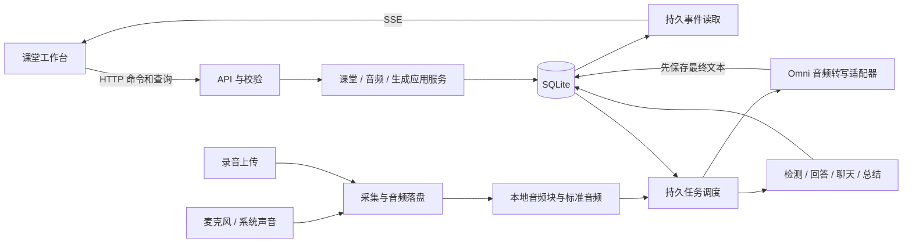

# Class Copilot 新版技术设计

版本：0.1；日期：2026-09-18。本文为新版技术设计，实现映射与测试结果见 [实施记录](实施记录.md)；产品依据是 [新版产品需求](新版产品需求.md)，对外约定是 [新版接口契约](新版接口契约.md)。不复用旧接口，不迁移旧数据库，不要求沿用旧模块划分。

## 1. 技术选择

| 层次 | 选择 | 目的与边界 |
| --- | --- | --- |
| 后端 | Python 3.12、FastAPI、Pydantic | 统一音频处理、模型调用、业务校验和接口定义 |
| 持久化 | SQLite、SQLAlchemy 2、Alembic | 本机单用户；从第一版开始使用显式数据库迁移 |
| 前端 | React 19、TypeScript、Vite、React Router | 一个课堂工作台和少量管理页面 |
| 前端数据 | TanStack Query + 局部组件状态 | 服务端实体缓存与输入草稿分开；不建立第二套全局业务数据库 |
| 通信 | HTTP JSON 命令/查询 + SSE 事件 | 长生成不占用命令执行通道；断线可补状态 |
| 音频 | sounddevice/PortAudio 麦克风；Ubuntu 系统音频适配器；FFmpeg/ffprobe | 平台采集隐藏在适配器中；编码与格式检查使用成熟工具 |
| 云端 | 百炼 HTTP 兼容接口；应用自有适配器 | 音频转写与文本生成分别建模；模型能力来自配置表 |
| 依赖与检查 | uv、npm、pytest、Ruff、tsc、Vitest、Playwright | 锁定依赖；状态机/协议测试与浏览器验收分层 |

不引入 Go 服务、Redis、消息中间件或桌面壳。现阶段一个本机进程和 SQLite 足够支撑业务；安装了 Go 不构成使用它的理由。

精确依赖版本在实现时解析并提交 `uv.lock`、`package-lock.json`；本文不把未经安装验证的版本组合写成已兼容。Vite 当前文档要求 Node 20.19+ 或 22.12+，本机 Node 22.22.1 满足其最低要求。[Vite 安装要求](https://vite.dev/guide/)

启动、恢复与关闭由 FastAPI lifespan 统一管理。[FastAPI 生命周期文档](https://fastapi.tiangolo.com/advanced/events/)

## 2. 系统结构



职责目录（实际首版将同进程模块收敛为 `domain.py`、`service.py`、`persistence.py`、`audio.py`、`provider.py`、`workers.py`、`main.py`，对应边界不变）：

```text
backend/
  pyproject.toml / uv.lock / migrations/
  src/class_copilot/
    main.py                 # 组合依赖、生命周期、启动入口
    api/                    # HTTP / SSE / DTO / 错误映射
    domain/                 # 状态、实体规则；不依赖 FastAPI
    application/            # 命令、查询、上下文选择和任务编排
    infrastructure/
      persistence/          # ORM、事务、事件与任务仓库
      audio/                # 采集、分块、编码、导入
      providers/            # Omni 转写、文本生成
      files/                # 安全路径、删除、恢复
    workers/                # 任务执行器和停止协调器
  tests/
web/
  package.json / package-lock.json
  src/{app,features,components,api,i18n}/
  tests/
docs/
data/next/                  # 运行数据；Git 忽略
```

使用新 `backend/.venv` 与 `web/`，避开根目录旧 `.venv` 的解释器错配及旧 `frontend/node_modules`、`frontend/dist`。不把旧构建产物当新版页面。

## 3. 核心不变量

1. 课堂记录独立于音频和任务。停止录音不关闭课堂，不取消聊天。
2. 全局音频槽位只有一个拥有者：从来源准备开始，到转写收尾结束或显式取消分析为止；上传未分析的文件不占槽位。
3. 最终转写、业务变更及对应的持久事件在一个事务内提交；后续检测任务也在同一事务登记，不能仅靠内存回调触发。
4. 网络请求、音频编码、模型流式生成不得在数据库事务或全局生命周期锁内等待。
5. 文件写入与数据库不是同一事务；依靠临时文件、原子重命名、清单及恢复扫描处理，不宣称跨资源原子性。
6. 所有模型任务记录输入内容版本、配置版本、模型名和上下文覆盖范围；运行中的任务不动态读正在被修改的配置。
7. 创建任务、用户消息和助手占位记录原子完成；一次重试形成新尝试，不能覆盖旧成功结果。
8. 服务单进程单 worker；数据目录加进程锁，第二个进程拒绝写同一库。进程锁之外仍有 DB 唯一约束和事务条件更新。

## 4. 状态模型

### 4.1 课堂

课堂只有 `ready → deleting → deleted` 的生命周期；录音中、识别中由子资源派生，禁止在课堂上使用混合含义的 `active/ended`。

`deleted` 表示实体已清除，仅删除任务和最小幂等结果保留到清理期结束。任务失败时课堂保持 `deleting`，可查询清理状态和重试。

### 4.2 音频来源

| 维度 | 状态 | 说明 |
| --- | --- | --- |
| 来源类型 | `microphone / loopback / upload` | 每个来源创建后不变 |
| 采集/接收 | `preparing / capturing / finalizing / ready / interrupted / failed` | 上传最终入库后从 ready 开始；中断来源仍可能有可用音频 |
| 转写 | `idle / queued / running / completed / partial / cancelled / failed` | completed 表示全部应处理块完成；partial 有成功也有失败/中断 |
| 音频资产 | `pending / available / partial / missing / failed` | 与转写分开，可先听录音再补文字 |

录音 `preparing → capturing → finalizing → ready`；启动失败进入 failed；进程/设备故障进入 interrupted，再尝试封装已保存块。来源已有 interrupted 标记时恢复音频不会抹掉中断事实。

停止请求把采集切到 finalizing，并创建/复用收尾任务；立即拒绝后续采集帧。音频槽位仍保留，待文件封装和识别收尾完成或显式取消分析后释放。UI 分别展示“已停止采集”“转写收尾中”。

### 4.3 任务与生成结果

`queued → running → succeeded / failed / cancelled / interrupted`。运行中收到取消先进入 `cancelling`，执行器释放资源后才进入 cancelled。取消不保证撤回已发往服务商的调用或费用。

任务类型包括 `start_source`、`test_audio`、`transcribe_source`、`detect_questions`、`generate_answer`、`chat_reply`、`summarize_lesson`、`finalize_source`、`delete_lesson`、`test_provider`。来源转写内部按块登记子任务/进度；总结分段提炼的子任务归同一父任务。

生成实体状态为 `pending / streaming / completed / failed / cancelled / interrupted`。失败可有内容；只有 completed 默认纳入后续生成上下文。任务、对应结果实体和事件的终态同事务保存。

## 5. 音频与指定模型的接入

### 5.1 已核对的供应商能力

`qwen3.8-omni-flash` 接受音频并输出文本，官方列出的接口为 Chat Completions 和 Responses；设计采用 HTTP Chat Completions，不给模型名自行追加 `-realtime`。[模型信息](https://help.aliyun.com/en/model-studio/qwen3-8-omni-flash)

适配器使用 `input_audio` 提交本地音频的 Base64 和格式，要求仅转写原语言；请求文本输出，关闭联网/工具，显式设置 `reasoning_effort="none"`，避免使用模型默认的高思考强度。流式文本只是该音频块的结果，不是持续上传音频的 WebSocket 协议。[Qwen-Omni 调用说明](https://help.aliyun.com/en/model-studio/qwen-omni)

首版不依赖服务商提供逐字时间戳或说话人信息。源时间由本地采样计数推导；转写时间范围就是提交音频块范围。长文件切块是本应用策略，不能把另一代 Omni 的整文件时长限制套给指定模型。

### 5.2 采集、保存和分段

- 设备帧在独立采集线程产生，带递增采样序号；实时录音规范化为 16 kHz 单声道 PCM16 后写块，保留采样率及处理参数。
- 内存只保留有界队列，音频磁盘块是可重试依据。磁盘线程与模型消费分开；队列溢出必须记录缺口并终止异常采集，禁止静默丢帧后继续显示正常。
- 初值：静音持续 600 ms 且块已满 2 秒时切段；连续讲话最多 12 秒切段。由本地音频特征决定边界，先做不重叠块；边界质量用样本验收，不能用删除相似句子掩盖断词。
- 原始块写 `.part`，完成后重命名并登记元数据/校验和；短尾段同样登记。编码进程将块生成标准 MP3；完成后再标记音频可用。
- 块标识 `(source_id, ordinal)` 唯一；转写重试只替换该失败尝试，不新建重复片段。确需重新转写成功内容的功能不在首版范围。
- 采集回调不做网络、SQL 或 FFmpeg 阻塞操作。录音中音量从采集流计算；测试音量与录音互斥。
- Ubuntu loopback 通过独立适配器枚举实际 monitor 来源，验证选择与采集对象一致；实现时用 PipeWire/PulseAudio 环境做真实设备验收。

### 5.3 导入和积压

上传写受限临时目录，后端生成文件名，用 ffprobe 校验；通过后移入该课堂来源目录。首版接受单文件 500 MiB/4 小时。用 FFmpeg 解码、规范化后走同一分段与转写流程，不按播放速度限速。

源内转写结果按块序号提交；并发结果乱序时等待缺失块进入终态后再推进有序水位。失败块记录 gap，不能让后面的完成块永久不见。

先给转写独立并发额度 1，导入可在实测后调至 2；文本生成另有并发额度。实时积压可保存到磁盘，不无限驻留内存。持续云端故障 60 秒后结束本轮转写任务，来源转写标为 partial 或 failed，未完成块留作补识别。录音可继续到来源时长/空间上限；页面提示“录音仍在保存，停止后可补识别”。停止流程只完成本地收尾，不擅自重启已失败的付费识别；用户随后通过 analysis 或 retry 显式补识别。

失败块重试成功后增加课堂内容版本，不重放已完成块的检测任务；补充片段按原始时间展示。若存在后续片段，不借此重新排序聊天等其他时间线。

## 6. 生成与任务调度

### 6.1 默认模型与配置

| 用途 | 默认模型 | 思考与策略 |
| --- | --- | --- |
| 音频转写 | `qwen3.8-omni-flash` | 用户指定；关闭思考，只转写 |
| 问题检测 | `qwen3.8-flash` | 关闭思考；结构化检测结果必须校验 |
| 自动答案、快速聊天、总结 | `qwen3.8-flash` | 默认关闭；摘要通过分段覆盖长课堂 |
| 质量聊天 | `qwen3.8-max` | 显式选择；思考由用户开关控制 |

文本默认值为本轮设计选择，依据官方当前模型列表，不是对所有工作空间可用性的保证。[文本模型介绍](https://help.aliyun.com/en/model-studio/text-generation-model/)

配置模型能力表（音频输入、文本流、结构化输出、思考参数），适配器将统一选项翻译为具体参数；缺少能力明确拒绝，不静默改模型。记录服务返回的实际模型版本/用量；未知计数为 null，不捏造费用。

### 6.2 队列、取消与重试

- SQLite jobs 是任务事实来源；内存队列只做唤醒。提交失败不会发起模型调用；提交成功后即使通知丢失，扫描仍能找到任务。
- 任务通过条件更新抢占；执行器持有 task_id，独立获得数据库会话。初始文本并发为 2，其中聊天优先，检测/回答/总结用剩余额度并采用公平轮转，避免总结占满。
- 同一课堂只有一个非终态聊天任务；同一问题同一时刻只生成一个新答案；同一课堂同时只生成一个总结。数据库约束兜底。
- 限流/网络错误在尚未产出内容时有限自动重试，最多 3 次，尊重 Retry-After 并加入退避。鉴权/参数错误立即失败；已有部分输出时不悄悄重开并拼接。
- 取消设置标志，由执行器停止下游调用、保存部分结果和终态。检查取消发生在开始调用前、每次流片段和每个子任务边界。
- 应用重启后，原 running/cancelling 和未执行的付费 queued 任务标为 interrupted；由用户显式重试。文件清理、音频修复等本地维护任务可自动续做。
- 自动任务带 `automation_revision`。模式切换取消旧版本 queued 任务，检测完成时再次检查当前版本后决定是否自动回答；已运行答案不强制抹除。
- 问题去重键包含课堂、规范化问题和来源范围；不跨课堂共享冷却内存。手动检测绕过冷却但返回重复命中。

### 6.3 上下文、版本与保存

每个任务固定 `content_revision` 和输入实体 ID 集合，控制消息按以下顺序组装：系统指令、选择的课堂内容、近期对话、当前用户问题。用一个预算器计算整个请求，预留输出与安全余量；不先截文本再重复附完整聊天。

首版应用预算：普通文本生成最多 32k 输入 tokens，输出最多 8k；检测输入最多 8k。适配器能力限制若更低则取低值。实现时验证 tokenizer/保守估算器，超限可继续裁剪旧内容但不得裁掉当前问题；当前问题自身超限时拒绝并提示缩短。

长课堂总结用有来源范围的分段摘要再合并；子摘要和覆盖信息保存在任务中。生成引用仅允许指向实际存在且已纳入上下文的片段。音频/课堂文字属于待分析内容，不能作为应用指令执行；首版不向模型开放系统工具。

流式内容先展示草稿；至多每 1 秒或累积 1 KiB（先达到者）保存一次完整文本检查点和实体 revision，终态强制保存。事件传完整检查点，不传需要精确累计的持久 token delta。正常断线可恢复已存检查点；进程突然终止可能丢失最近未保存草稿，界面不把草稿标为已保存。

答案、助手回复和总结都保留尝试/版本。成功版本默认用于后续上下文；失败部分只在查看/导出时显示，不冒充完成结果。

## 7. 数据结构与约束

所有 ID 为 UUID；公共时间为 UTC RFC3339；音频位置为相对来源的整数毫秒。表中列出业务字段，通用的创建/更新时间、revision、外键和索引在迁移中显式声明。

| 表 | 关键字段与约束 |
| --- | --- |
| courses | id, name, normalized_name UNIQUE |
| lessons | id, course_id, custom_title, lifecycle, automation_mode, automation_revision, content_revision；课程 FK RESTRICT |
| audio_sources | id, lesson_id, ordinal, kind, capture_state, transcription_state, settings_revision, duration_ms, gap_ranges, stop_at；UNIQUE(lesson_id, ordinal) |
| audio_assets | id, source_id, role(original/playback), relative_path, checksum, bytes, duration_ms, state |
| audio_chunks | id, source_id, ordinal, start_ms, end_ms, relative_path, checksum, state, attempts；UNIQUE(source_id, ordinal) |
| transcript_segments | id, lesson_id, source_id, chunk_id UNIQUE, ordinal, start_ms, end_ms, text, model；只有最终成功文本 |
| questions | id, lesson_id, text, origin, confidence(nullable), dedup_key；引用片段关系单独保存 |
| question_segments | question_id, segment_id；联合主键、外键 |
| answer_versions | id, question_id, version, style, language, content, state, job_id, model；UNIQUE(question_id, version) |
| chat_turns | id, lesson_id, ordinal, user_text, options；UNIQUE(lesson_id, ordinal) |
| chat_replies | id, turn_id, attempt, content, state, job_id, model；UNIQUE(turn_id, attempt) |
| summary_versions | id, lesson_id, version, include_chat, content, state, job_id, basis_revision, coverage；UNIQUE(lesson_id, version) |
| jobs | id, kind, lesson_id(nullable), source_id(nullable), parent_id, retry_of, state, input_snapshot, progress, error, cancel_requested, started_at, finished_at |
| events | seq INTEGER PRIMARY KEY AUTOINCREMENT, type, lesson_id(nullable), entity_id, payload, created_at；按 seq 读取 |
| settings | 单行 revision 与校验后的配置 JSON；模型角色及生效边界明确 |
| credentials | provider_id, encrypted_secret, mask；不与公开 settings 序列化复用 |
| idempotency_keys | key, operation, request_hash, response_status, response_body, expires_at；UNIQUE(key) |

开启 foreign_keys、WAL 和 busy_timeout，事务短小。数据库级唯一约束/条件更新覆盖名字、块落库、版本和活动任务；不只靠页面禁用按钮。事件与幂等响应里不存 Key、上传二进制或完整音频数据。

内容版本在最终转写、问题、答案完成和聊天变更时增加；总结自身写入不让自己立即过期。总结保存按是否 include_chat 计算的内容签名，过期判断只看实际依赖是否改变。jobs/input_snapshot 保留配置值和凭据版本引用，禁止把解密后的 Key 放进任务 JSON、事件或错误。

## 8. HTTP、快照和 SSE 恢复

写命令统一走 HTTP，长工作返回 202 和 job。浏览器每标签只开一条 `/api/v1/events` 连接，接收全局单用户事件后按 lesson_id 分发。SSE 支持事件 ID 与重连，适合本应用的单向推送；HTTP/1 多标签连接数限制应在浏览器验收中检查。[MDN SSE 说明](https://developer.mozilla.org/en-US/docs/Web/API/Server-sent_events/Using_server-sent_events)

恢复顺序：

1. 在同一个 SQLite 读事务中取课堂快照及全局 event_cursor。快照返回最新分页内容、活跃任务和总数量。
2. 从 cursor 开始订阅/补读事件；订阅建立前发生的提交也能从 events 表读取。内存通知丢失时周期性查表补齐。
3. 持久事件有递增 seq 和实体 revision，至少一次送达；前端忽略重复 seq/旧实体 revision。更新内容使用完整替换，避免多次追加相同文字。
4. 音量、识别草稿为临时事件，不写事件表、不推进恢复 cursor；重连后允许消失或重新产生。持久检查点决定已保存状态。
5. 游标超出保留窗口时发送 `reset_required`，客户端关闭旧流、重取快照再接续，不无限循环重放。
6. 事件保留最近 7 天且最多 100,000 条，超过任一上限可清理；实体数据不随事件日志清理。游标是全局游标，不能跨不同数据目录使用。

只在提交后发布事件。前端重连不自动重发旧命令；超时后按幂等键查同一结果。详细信封和错误见接口契约。

## 9. 文件、删除、凭据与恢复

- 数据根默认仓库内 `data/next/`，也可显式指定独立绝对目录。启动检查 schema 标记；如果指定目录内有旧版库，拒绝把它当新版打开。
- 文件路径仅后端生成的相对路径；解析后必须位于数据根下，拒绝路径穿越/符号链接逃逸。上传原名只作显示，不参与命令拼接。
- FFmpeg/ffprobe 使用参数列表启动，不经过 shell；限制运行时长、输出、资源占用。外部网络输入和播放列表引用不作为支持的上传格式。
- Key 使用数据目录内独立密钥加密，目录权限 0700、密钥文件 0600；不声称这能抵御同一用户读取整个目录。新旧版凭据完全独立。
- 服务默认绑定 127.0.0.1，生产前后端同源；校验 Host、Origin 和写请求的 CSRF token。开发只允许明确的本地前端 origin，禁用通配 CORS；首版不提供公网访问模式。
- 删除：事务检查活动任务并将课堂置 deleting，同时登记清理任务；所有新增任务在同一锁/事务边界检查生命周期。任务移除归属文件，成功后删除业务数据；文件失败保留可重试清理状态。删除事件和任务使用最小 tombstone，不被级联误删。
- 下载只通过资产 ID，检查归属、状态、是否常规文件；音频支持 Range。不存在或损坏返回可识别错误，不暴露绝对路径。
- 启动恢复：持有目录锁 → schema 升级 → 非终态音频/任务对账 → 扫描本版受管 `.part`/块清单 → 尝试封装可恢复音频 → 发布恢复事件。禁止遍历旧数据区域。
- 退出先拒绝新任务，再停止采集、提交尾块、尽力保存检查点和封装；设置总超时，未完成标 interrupted，下次恢复，不无限等待云端。

## 10. 实施顺序与完成标准

下列阶段是实施拆分；当前已有可运行实现，自动化和真实验收的区别见 [实施记录](实施记录.md)。阶段完成后更新本节证据，而不是只改勾选状态。

| 阶段 | 交付内容 | 退出条件 |
| --- | --- | --- |
| M0 文档与决策 | 新版需求、设计、契约；旧功能映射 | 七项用户决定写入；37 项旧功能有去向；文档检查通过 |
| M1 可运行基础 | 新环境、迁移、课程/课堂 API、工作台框架、错误和幂等 | 新库独立启动；课程/课堂操作与冲突行为测试通过 |
| M2 音频→转写 | 指定模型适配器、文件上传、块处理、播放下载，再接麦克风/系统声音 | 合成音频自动化闭环通过；真实模型/设备单独验收；停止与重试不丢块 |
| M3 课堂辅助 | 三种模式、问题、答案版本、聊天、总结、任务取消/重试 | 无需正在录音也能完整使用；长生成不阻塞停止；关键状态测试通过 |
| M4 稳定性与产品完善 | SSE 恢复、设置、导出、删除、恢复、i18n、主题、故障诊断 | V-01～V-30 逐项有结果；4 小时样本运行及浏览器操作验收 |

M1 即建立持久任务/事件的最小结构，后续逐步使用；M4 是跨功能完整验收，不能把持久化、错误处理全部拖到最后再补。

测试重点：行为约束与故障恢复，不为字段搬运写大量镜像测试。使用 FakeCapture/FakeTranscriber/FakeGenerator 注入慢调用、乱序、断线、磁盘错误；固定生成 WAV 验证音频流程，不拿用户旧录音作为默认测试数据。真实云调用与硬件测试单独标记，使用获准样本和配置；mock 通过不等于模型识别质量通过。

## 11. 当前环境与未验证项

2026-09-18 本机检查：Python 3.12.13、Node 22.22.1、npm 9.2.0、Go 1.26.0、uv 0.12.3 可执行；动态链接器已列出 `libportaudio.so.2`。这修正了先前工具未安装/系统库缺失的历史状态。

根目录旧 `.venv` 的解释器/依赖版本错配不通过“再次安装系统 Python”解决；新项目会使用明确 Python 3.12 创建的独立环境。没有读取旧 Key，没有调用用户云端模型，没有采集麦克风，也没有迁移或改写旧数据。

仍需真实验证：指定模型在用户工作空间的权限和参数、短音频逐字转写效果、边界断词、云端延迟及限流、系统声音枚举、长时间编码恢复。功能设计已给出失败时的行为，不将这些项目写成已经通过。

## 12. 实现说明

- 首版模块按职责使用平铺 Python 文件，避免只有一两个实现的多层空目录；API DTO 独立于内部快照，OpenAPI/TypeScript 自动生成。
- SQLAlchemy Core 管理事务和关系约束，实体的可变业务字段保存在版本化 JSON；外键、唯一键、活动任务槽位及查找列显式建表和索引。初始 Alembic 迁移冻结 DDL，后续升级必须增加迁移。
- 上传本身不需要模型配置，第一次分析时固化识别设置；重新分析/重试沿用该快照。实时录音在创建来源时固化设置。
- 上下文使用保守 UTF-8 字节上界计量，所有文本请求在发送前再次检查 8k/32k 输入预算。长总结包含问题、成功答案以及显式选择的聊天，并按批提炼再合并。
- 麦克风使用 PortAudio 精确设备标识；Ubuntu 系统声音使用 `pactl` 枚举 monitor 和 `parec --device` 采集，没有工具或 monitor 时明确报错。
- 正常退出停止采集并尽力封装；意外退出只自动恢复本地维护任务。未执行完的付费生成及未创建的自动总结须显式重试或重新生成。
- 当前监听端口为 `127.0.0.1:29038`，避开旧版端口；前端生产构建由同一服务托管。
